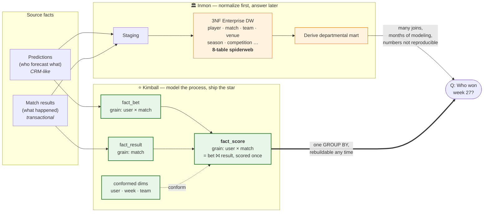

# Marrying the Bettor to the Ball: On Joining a CRM of Predictions to a Fact Stream of Reality

### A short, mildly rigorous, occasionally funny note on dimensional modeling

> **Abstract.** We revisit a problem as old as the data warehouse itself: two
> populations of facts that stubbornly refuse to be the same shape. On one side,
> a *CRM-like* stream of intentions — customers (here, players) declaring what
> they *think* will happen. On the other, a *transactional* stream of events —
> the world reporting what *actually* happened. Management wants a single number
> ("who was right, and by how much?") and wants it to be reproducible on a
> Tuesday. We compare the two dominant schools of warehouse design — Inmon's
> Corporate Information Factory and Kimball's dimensional modeling — and argue,
> with a flow chart and a straight face, that for this class of problem Kimball
> wins. We illustrate with a small live system so we can claim the work is
> "empirical."¹

---

## 1. The problem, stated without mercy

Every analytics team eventually meets the same monster wearing different hats:

- **The CRM side** knows *who wants what.* Leads, opportunities, forecasts,
  pledges, predictions. It is full of humans and their optimism.
- **The transactional side** knows *what the universe actually did.* Orders
  shipped, trades cleared, goals scored. It is full of timestamps and regret.

The business question that pays your salary always sits *across the join*:

> *Of the things people predicted, which came true — ranked, per period,
> reproducibly, and cheaply enough to recompute whenever someone finds a bug?*

This is not a soccer problem. It is the **forecast-versus-actual** problem, and
it recurs everywhere: sales pipeline vs. closed revenue, weather models vs.
rainfall, analyst price targets vs. the tape, your New Year's resolutions vs.
February. Predictions are a fact. Outcomes are a fact. The value is the
*difference between two facts* — which, as we'll see, is precisely the thing
naïve schemas make expensive.

We will borrow one concrete instance for illustration — a World Cup prediction
game² — but the game is a fruit fly: cheap to breed, fast to kill, and
genetically honest about the phenomenon we actually care about.

---

## 2. Two churches, one congregation

Data warehousing has spent thirty years in a mostly-polite schism.

### Inmon: build the cathedral, then hold services

Bill Inmon's **Corporate Information Factory** is *top-down*. First you construct
a single, enterprise-wide, **fully normalized (3NF)** integrated repository — the
capital-T Truth — subject-oriented, non-volatile, time-variant, and allergic to
redundancy. *Then* you carve **departmental data marts** out of it for the people
who actually run queries.

It is architecturally magnificent. It is also the software equivalent of
insisting on a wedding cathedral before you're sure the couple has met. You
normalize `prediction`, `player`, `match`, `team`, `venue`, `competition`,
`season` into a spiderweb of foreign keys, all beautiful, all correct, and all
requiring an eight-table join before anyone learns who won last week.

### Kimball: model the *business process*, ship the star

Ralph Kimball's **dimensional modeling** is *bottom-up*. You pick a **business
process** ("a player predicts a match"; "a match produces a result"), you declare
its **grain** in one plain sentence, and you build a **star schema**: a central
**fact table** of measurements surrounded by **denormalized dimension tables**
of context (who / what / when). Marts are the deliverable, not an afterthought.

The star is deliberately, unapologetically **denormalized**. Redundant? Yes.
Inmon would clutch his pearls. But redundancy bought at design time is *query
speed and comprehensibility* bought at 2 a.m. when the number is wrong and the
tournament is live.

| | **Inmon (CIF)** | **Kimball (dimensional)** |
|---|---|---|
| Direction | Top-down | Bottom-up |
| Center of gravity | The enterprise model | The business process |
| Core structure | 3NF normalized EDW | Denormalized star schema |
| Marts | Derived, later | The point, now |
| First useful answer | After the cathedral | After the first star |
| Optimizes for | Integration & governance | Query speed & clarity |
| Failure mode | Analysis paralysis | Mart sprawl if dims aren't *conformed* |

Neither is *wrong*. They optimize different loss functions. The engineering
question is never "which is correct?" but "which pain do I want?"

---

## 3. The subtle bit everyone gets wrong: you can't just join two facts

Here is the trap, and it is a good one.

Predictions are a fact table at grain **player × match**. Results are a fact table
at grain **match**. The obvious move — *"just join fact to fact"* — is a classic
Kimball **anti-pattern.** Fact-to-fact joins fan out, double-count, and produce
numbers that are wrong in ways that survive code review because they *look*
plausible. (The canonical war story: someone joins an orders fact to a shipments
fact and reports revenue that never existed. Here, the equivalent bug is scoring
an exact-score hit as `1 + 3 = 4` points instead of `3`. Ask us how we know.³)

The dimensional cure is a two-parter:

1. **Conform the dimensions.** `dim_user`, `dim_week`, `dim_team` are *shared* —
   identical keys and meaning across every fact. Conformed dimensions are the
   entire trick: they are what lets independently-built stars talk to each other
   without a summit meeting.
2. **Materialize a derived fact at the common grain.** Instead of joining the two
   facts at query time and praying, you *precompute* a new fact —
   `fact_score`, grain **player × match** — as `fact_bet ⨝ fact_result` pushed
   through **one** canonical scoring function. The messy join happens **once**, in
   one place, deterministically. Every downstream number is then a boring
   `GROUP BY` over a clean table.

That's the whole thesis. The "marriage" of the CRM stream and the transaction
stream is not a query — it's a **modeled artifact**: a consolidated fact,
computed and never hand-edited, sitting at the grain where the question lives.

---

## 4. The flow chart that earns its keep

Both schools can *answer* "who won week 27?" The difference is how far the data
has to travel — and how many places a wrong number can hide en route.

Read the two paths to the same box `Q`:

- **Inmon** routes through a normalized cathedral. Correct, integrated,
  governable — and *long*. The answer is many joins and one reorg away, and
  because the scoring logic lives wherever the analyst last wrote it, two people
  can compute "who won" two different ways.
- **Kimball** routes through a single derived fact at the question's own grain.
  The gnarly forecast-⨝-actual join is resolved **once**, canonically, upstream;
  the report is a `GROUP BY`. When someone finds a scoring bug, you fix the one
  function and **rebuild the whole thing from source** — deterministically,
  before lunch.

The advantage the chart is meant to make obvious: *the distance from raw fact to
trustworthy answer, and the number of places a wrong number can hide, are both
smaller on the Kimball path.* That's not aesthetics. That's mean-time-to-correct.

---

## 5. In fairness to the cathedral

Kimball is not a universal solvent, and pretending otherwise is how you get
burned in year three.

**Inmon earns its keep when:**

- You integrate **dozens of source systems** with conflicting definitions of
  "customer," and someone with a compliance badge needs *one* reconciled,
  auditable, normalized system of record.
- Your horizon is decades and your regulators have subpoena power. Normalization's
  update-anomaly guarantees are worth their weight then.
- The enterprise model itself is the deliverable — the marts are secondary.

For a forecast-vs-actual scoreboard with a handful of clean sources and a
business question that fits in one sentence, that machinery is a cathedral built
to shelter a hot-dog stand. Kimball's bottom-up star gets you a correct,
reproducible answer this week and *conforms its way* toward the enterprise later
— the famous **bus architecture**: ship stars, share dimensions, and the
warehouse assembles itself from parts that were useful the day they were built.

(The modern **medallion** layout — bronze *raw* → silver *conformed star* → gold
*marts* — is really just Kimball wearing a hi-vis vest. Bronze is your staging,
silver is the star, gold is the mart. Same theology, newer hymn book.)

---

## 6. A fruit fly, dissected (the practical example, in passing)

The live instance we borrowed⁴ implements exactly the above and nothing fancier:

- **Bronze** — raw, single-owner: `predictions` (the CRM-ish intent stream),
  `matches` (schedule + result), plus a `bronze_adjustments` table so that
  *manual* corrections are an **input** to the model, never an edit of its output.
- **Silver (the star)** — conformed `dim_user / dim_week / dim_team`, the two
  base facts `fact_bet` and `fact_result`, and the derived `fact_score =
  fact_bet ⨝ fact_result` through one scoring function of about four lines.
- **Gold (marts)** — `champions` (user × week) and `leaderboard` (user), each a
  plain aggregate the API reads directly.

The whole thing is rebuilt from bronze on a schedule and on demand — *idempotent,
deterministic, drop-and-rebuild.* The governing principle fits on a sticky note:

> **One owner per fact. Unidirectional flow. Derived data is computed, never
> authored.**

That sentence is the entire moral of dimensional modeling, and it is why, when a
scoring rule changes at 11 p.m. mid-tournament, the fix is a four-line function
and a rebuild rather than an archaeology dig through a normalized enterprise
schema. We are not selling you the game.⁵ We are selling you the sticky note.

---

## 7. Conclusion

The forecast-versus-actual join — CRM intent on one side, transactional reality
on the other — is a solved problem, and it was solved by *refusing to solve it at
query time.* You conform your dimensions, you materialize a consolidated fact at
the grain of the question, and you let every report downstream be boring. Inmon
would have you build the truth first and query it forever after; Kimball has you
model the business process, ship the star, and conform your way to the enterprise.
For a scoreboard — and for most things shaped like a scoreboard — the star wins on
the metric that actually matters at 2 a.m.: *how fast can you make a wrong number
right?*

Kimball, R. *The Data Warehouse Toolkit* remains, thirty years on, one of the few
technical books whose central advice ("declare the grain") would also improve
most people's dating lives. Declare the grain. Conform your dimensions. Compute,
don't author. Go in peace.

---

### Footnotes

1. "Empirical" here means "we ran it and it did not catch fire." Reviewer 2
   remains unsatisfied.
2. World Cup 2026 — 48 teams, 104 matches, three host countries, one very
   confident uncle in every group chat.
3. `correct_outcome → +1`; `exact score → 3` *total*, not `+1 +3 = 4`. The `= 4`
   version shipped first. This is why we compute scores in exactly one place now.
4. A small serverless prediction game (`bettyscores.com`), cited purely as a
   worked example. Its mascot is a schnauzer, which is not load-bearing to the
   argument.
5. Legally distinct from selling you the game.
